<p align="center">
  
</p>

<p align="center">
  <a href="https://govind-codex.github.io"><strong>Live portfolio</strong></a>
  &nbsp;·&nbsp;
  <a href="https://govind-codex.github.io/contact"><strong>Contact</strong></a>
  &nbsp;·&nbsp;
  <a href="https://www.linkedin.com/in/govindnagar"><strong>LinkedIn</strong></a>
</p>

<p align="center">
  
  
  
  
</p>

## About

A motion-rich developer portfolio built around one idea: the same work should be explorable in different ways. Visitors can move between minimal, static, dynamic, and story-driven interfaces without leaving the site.

The portfolio highlights backend engineering, full-stack products, project case studies, technical writing, GitHub activity, and direct contact—all in a responsive, accessible experience.

## Highlights

- **Four visual modes** — Minimal, Static, Dynamic, and Story.
- **Command search** — Open with `⌘ K` or `Ctrl K` to search writing, jump to projects, open social links, or switch theme.
- **Purposeful motion** — Framer Motion transitions, a Lenis-powered scroll experience, and an animated custom cursor.
- **MDX content system** — Project case studies and technical articles powered by Fumadocs.
- **Live integrations** — GitHub activity, Google Analytics reporting, Cal.com scheduling, and server-side contact delivery.
- **Responsive and accessible** — Keyboard navigation, visible focus states, semantic controls, and reduced-motion support.

## Technology

| Layer | Stack |
| --- | --- |
| Framework | Next.js 16, React 19, TypeScript 6 |
| Styling | Tailwind CSS 4, Radix UI, class-variance-authority |
| Motion | Framer Motion, Lenis, View Transitions |
| Content | MDX, Fumadocs Core, Fumadocs UI |
| Data | GitHub GraphQL API, Google Analytics Data API |
| Forms | React Hook Form, Zod, Resend Email API |
| Deployment | Vercel, GitHub Actions |

## Quick start

Requirements: Node.js 20+ and npm.

```bash
git clone https://github.com/govind-codex/GovindNagar.git
cd GovindNagar
npm install
npm run dev
```

Open [http://localhost:3000](http://localhost:3000).

## Environment variables

Copy `.env.example` to `.env` and fill only the integrations you use.

```env
# GitHub data
GITHUB_TOKEN=
PROJECTS_CE_TOKEN=

# Google Analytics
GA_SERVICE_ACCOUNT_KEY=
NEXT_PUBLIC_GA_MEASUREMENT_ID=
GA_SITE_PROPERTY_ID=

# Contact delivery
RESEND_API_KEY=
CONTACT_TO_EMAIL=
CONTACT_FROM_EMAIL=
```

All credentials are read on the server. Never commit `.env` or expose server keys through `NEXT_PUBLIC_` variables.

## Project structure

```text
GovindNagar/
├── app/                         # Next.js routes, layouts, metadata, and APIs
│   ├── (pages)/                 # Portfolio pages and case studies
│   ├── api/                     # Search, analytics, contact, and OG routes
│   ├── contact/                 # Contact experience
│   └── docs/                    # MDX documentation and writing
├── @/
│   ├── components/              # UI, animated, and application components
│   ├── constants/               # Shared UI configuration
│   ├── hooks/                   # Client hooks
│   └── lib/                     # Project and layout utilities
├── content/                     # Technical writing MDX
├── src/                         # Data, SEO, stories, and resume content
├── public/                      # Static assets
└── project.config.ts            # Portfolio identity and feature configuration
```

## Customize the portfolio

Most personal content is centralized in [`project.config.ts`](./project.config.ts):

- name, role, biography, and location;
- social profiles and contact information;
- skills and technology groups;
- analytics configuration;
- footer navigation and SEO metadata.

Project case studies live in `src/resume/projects`, work experience in `src/resume/work`, and technical writing in `content/systems`.

## Commands

| Command | Purpose |
| --- | --- |
| `npm run dev` | Start the development server |
| `npm run build` | Create a production build |
| `npm run start` | Run the production server |
| `npm run format` | Format source and Markdown files |
| `npm run analyze` | Build with bundle analysis enabled |

## Deployment

The included GitHub Actions workflow deploys to Vercel. Configure the following repository secrets before enabling it:

```text
VERCEL_ORG_ID
VERCEL_PROJECT_ID
VERCEL_TOKEN
GITHUB_TOKEN
PROJECTS_CE_TOKEN
```

Add the Analytics and Resend variables in the Vercel project settings when those integrations are enabled. Because contact and analytics use server routes, deploy to a platform that supports the Next.js runtime rather than a static-only export.

## License and attribution

This project is available under the [MIT License](./LICENSE). It is adapted from an open-source portfolio template and customized with Govind Nagar's content, projects, and interaction design. See the in-app attribution page for additional credits.

<p align="center">
  <sub>Designed and built by <a href="https://github.com/govind-codex">Govind Nagar</a>.</sub>
</p>
